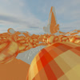
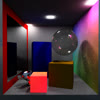

<!-- stats.... -->

<!-- &hide=CSS,HTML -->
<!-- normal || compact || donut || donut-vertical || pie  https://github.com/anuraghazra/github-readme-stats#customization-->

<!-- (HTML and CSS removed due to doxygen polluting it etc.) -->

## Projects - [https://projects.ivsop.dev](https://projects.ivsop.dev)

<table>
  <tr>
    <td width="100" valign="top"></td>
    <td valign="top"><b><a href="https://x.com/EggyLeague">Eggy League</a></b> fully on-chain multiplayer soccer game - Matrix Hackathon winner of the MagicBlock track</td>
  </tr>
  <tr>
    <td width="100" valign="top"></td>
    <td valign="top"><b><a href="https://github.com/IVSOP/MarchingCubes">Marching Cubes Game Engine</a></b> 3D game engine with marching cubes, ECS, audio and physics</td>
  </tr>
  <tr>
    <td width="100" valign="top"></td>
    <td valign="top"><b><a href="https://github.com/IVSOP/Particles">Particlinator</a></b> Deterministic GPU-driven particle simulator that can render images using particles</td>
  </tr>
  <tr>
    <td width="100" valign="top"></td>
    <td valign="top"><b><a href="https://github.com/IVSOP/raynaldo">Raynaldo</a></b> CPU ray tracer written in rust, using embree</td>
  </tr>
  <tr>
    <td>
      <a href="https://projects.ivsop.dev">See more</a>
    </td>
  </tr>
</table>

## Web3 - Solana

NFT Marketplace - Robust, fast and flexible NFT marketplace, written using pinocchio and typescript. Source unavailable for now.

[NFT robber](https://github.com/IVSOP/nft_robber) - Leverages surfpool to change binary data of accounts, changing ownership and authority of NFTs for local testing.

[Fast ATA](https://github.com/IVSOP/fast_ata_pinocchio) - Pinocchio utility for computing and creating ATA accounts, giving you control over the bumps.

[MPL Core Pinocchio](https://github.com/IVSOP/mpl_core_pinocchio) - Pinocchio utility for interacting with Metaplex Core, as well as custom deserialization and serialization of Core NFTs and Core Collections.

[pNFT Pinocchio](https://github.com/IVSOP/pnft_pinocchio) - Pinocchio utility for interacting with Metaplex Metadata, specifically the Programmable NFT features. Also with custom deserialization and serialization of NFTs and Metadata accounts.

[Eggy League](https://x.com/EggyLeague) - Fully on-chain multiplayer soccer game.

## University
| Class | Description | Language | Grade |
| ------------- | ------------- | ------------- | ------------- |
| [Laboratórios de Informática I](https://github.com/IVSOP/Projeto-LI1)  | Box Dude game | Haskell | 20 |
| [Laboratórios de Informática II](https://github.com/IVSOP/Projeto-LI2/)  | Stack machine language interpreter | C | 20 |
| [Laboratórios de Informática III](https://github.com/IVSOP/LI3)  | Efficient database queries / encapsulation | C | 19 |
| [Sistemas Operativos](https://github.com/IVSOP/ProjetoSO)  | Process executing and logging | C | 19 |
| [Sistemas Distribuídos](https://github.com/IVSOP/projeto-sd)  | N clients - 1 Server - N workers | Java | 20 |
| [Comunicações por Computador](https://github.com/IVSOP/CC) | Torrenting UPD/TCP | C++ | 19 |
| [Interface Pessoa-Máquina](https://github.com/IVSOP/IPM) | Mechanic shop website | HTML + CSS + JS + Vue | 20 |
| [Computação gráfica](https://github.com/IVSOP/CG) | Graphics engine using OpenGL | C++ + GLSL | 20 |
| [Engenharia Web](https://github.com/IVSOP/ProjetoEW) | Virtual map of Braga | Node.js + Express + MongoDB + ... | 20 |
<!-- mnol????? 20 -->
<!-- RC 18.62 -->
<!-- li3 foi roubado, melhor perf -->
<!-- 
Projeto Inf 17, foi fazer o site para interagir com zero knowledge por causa da energia

ESR 19: streaming. pacotes sao routed por varios nodos de CDN, com partilha aonde for possivel, para ser mais eficiente possivel; usava broadcast ou la o que era

VTR 19: https://github.com/IVSOP/particlinator

VI 19: https://github.com/IVSOP/raynaldo

VCPI 19: cyclegan https://github.com/IVSOP/VCPI-GAN

SDGE 17: https://github.com/IVSOP/SD-chord  dht in erland

CPAR 17: https://github.com/IVSOP/CPAR-1, paralelize fuild simulation

PSD igual a SDGE

RAS microservicos 17 prai

ASCN nao vale a pena

-->